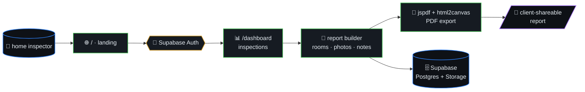

# InspectFlow

> Modern, affordable home inspection report software for independent
> home inspectors. Competitors (Spectora $109/mo, HomeGauge $89/mo,
> Home Inspector Pro $74/mo) are overpriced for solo/small operators —
> InspectFlow costs **$19/mo**.



## Table of contents

- [Stack](#stack)
- [Architecture](#architecture)
- [Getting Started](#getting-started)

## Stack

- **Framework:** Next.js 16 (App Router, TypeScript)
- **Styling:** Tailwind CSS v4
- **Database:** Supabase (Postgres + Auth + Storage)
- **UI:** Radix UI primitives + custom components
- **Icons:** Lucide React
- **PDF:** jspdf + html2canvas
- **Animations:** Framer Motion
- **Package Manager:** Bun

## Architecture

- `/src/app/` — App Router pages
- `/src/components/` — Reusable components
- `/src/lib/` — Utilities, Supabase client, types
- `/src/app/api/` — API routes

## Getting Started

```bash
bun install
bun run dev
```

Open [http://localhost:3000](http://localhost:3000).
